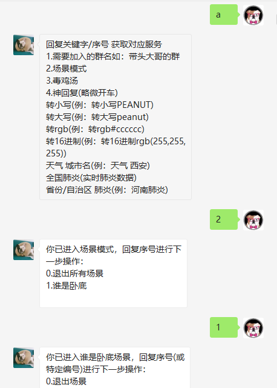
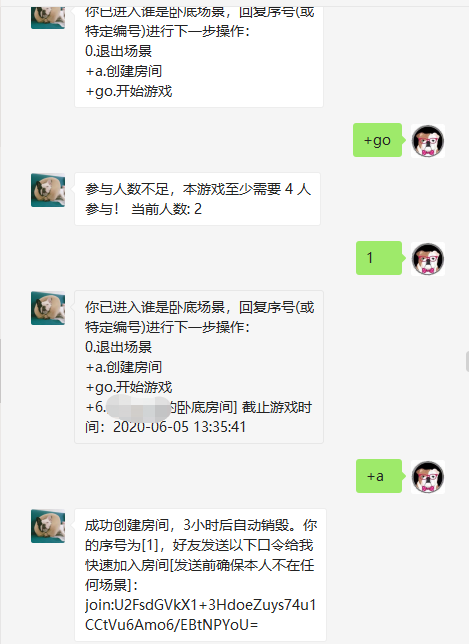
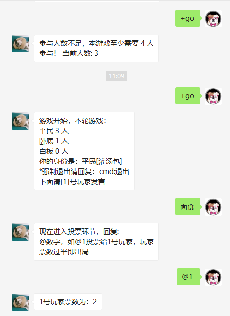

## nodejs 结合 wechaty 实现你的微信群聊机器人
[](https://github.com/chatie/wechaty)
[](https://github.com/juzibot/Welcome/wiki/Everything-about-Wechaty)

### 如何获取免费 Token
官方文档中提供了免费 token 的获取方式。
[https://github.com/juzibot/Welcome/wiki/Support-Developers](https://github.com/juzibot/Welcome/wiki/Support-Developers)
添加 `botorange_yeah` 为微信好友，填写审查表，到https://github.com/juzibot/Welcome/wiki/Support-Developers 编辑页面，底部添加自己的信息，就会免费发放 `15` 天的 Token。
15 天后，需要提交一个 MVP（最小可行化产品）的 github 仓库，并发布一篇博文，即可提供长期免费的 Token。


```bash
npm install
```

### 目录结构

- `config`文件夹存放公共配置文件以及`fly`请求相关配置
- `imgs`存放相关图片
- `listeners`存放机器人初始化后一系列事件处理(分模块)
  - `games` 游戏模块
  	- `iswho.js` 谁是卧底核心模块
  - `on-friendship.js` 处理好友请求
  - `on-login.js` 处理登录
  - `on-message.js` 处理用户消息、群消息
  - `on-scan.js` 处理登录二维码
  - `on-work.js` 做一些额外任务
- `schedule` 对定时任务`node-schedule`库进行了封装
- `migrations` 数据库迁移文件
- `api` 存放所有的数据请求、接口封装都在此
- `utils` 公用方法的封装
- `app.js` 入口文件
- `db.js` 数据库入口文件
- `knexfile.js` 数据库配置文件

### 如何使用

1. 修改`config`配置
   打开`config/index.js` 文件，将里面的配置改为自己的。
   token 和 name 必填
2. 修改天行接口配置
   天行 api 官网 ：[https://tianapi.com/](https://tianapi.com/)  
    注册成功后，申请以下接口：

   - [每日英语一句话](https://www.tianapi.com/apiview/62)
   - [神回复](https://www.tianapi.com/apiview/39)
3. 依赖sqlite3 和 redis, redis应需要单独安装

然后就可以运行了

```bash
npm run initdb
npm start
```
### 注意
- Description: Log Wechaty Events: `"dong" | "message" | "error" | "friendship" | "heartbeat" | "login" | "logout" | "ready" | "reset" | "room-invite" | "room-join" | "room-leave" | "room-topic" | "scan"`

### 已实现功能

- [x] 发送加群关键字，自动拉人进群。
- [x] 场景模式
  - [x] 谁是卧底
- [x] 神回复
- [x] 英语一句话
- [x] 天气查询
- [x] 发送关键字，踢人

列几个有趣的功能，可以去参考着实现：

- [ ] 随机好友聊天

### 谁是卧底小游戏



